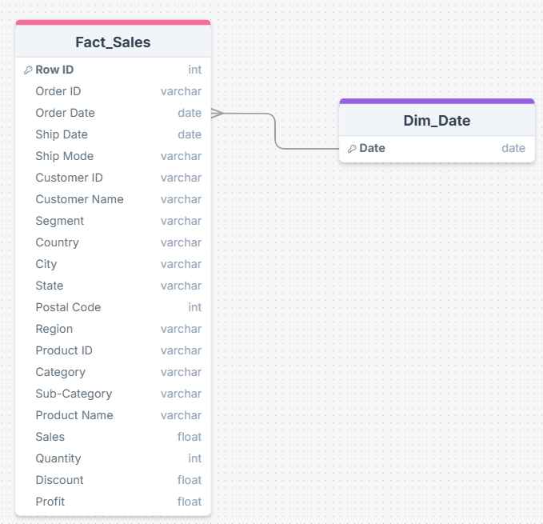
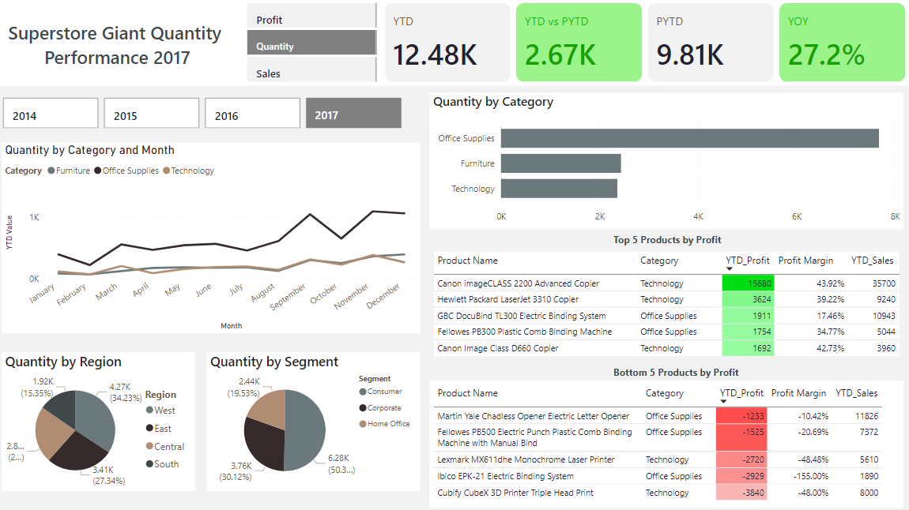
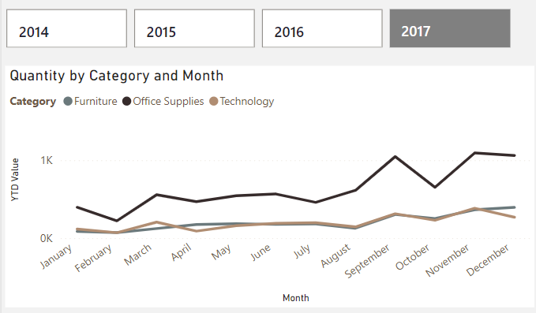
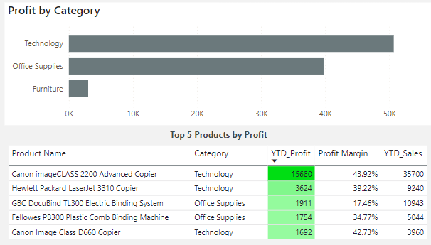
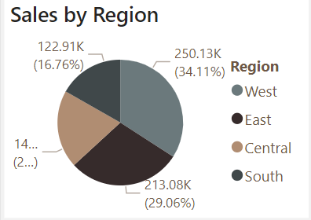

# Project Background
With growing demands and cut-throat competitions in the market, a Superstore Giant is seeking knowledge in understanding what works best for them in terms of products, regions, categories based on a dataset from 2014 to 2017.  This project thoroughly analyzes this dataset in order to unearth critical insights that will help Superstore Giant’s commercial success.

Insight and recommendations are provided on the following key areas:

- Product level performance: An analysis of Superstore Giant’s various product categories, understanding their impact on sales and profit,
- Regional comparisons: An evaluation of sales, profit and quantity by region.
- Sales trends analysis: Evaluation of historical sales pattern, focusing on quantity, profit and sales.

An interactive Tableau dashboard used to report and explore sales trends can be found here [link](Superstore Giant Analysis)

# Data Structure & Initial Checks

Initialy, there was only one table in the dataset, so right after I had cleaned the dataset, I added another table and named it Dim_date as a dimension table for date. A description of each table is as follows:

# Executive Summary

### Overview of Findings

Some key insights to take away from this project are: 
- The Technology category exhibits strong seasonal demand, particularly from August to December, driven by back-to-school promotions and holiday shopping, suggesting an opportunity for timely marketing campaigns.
- While Office Supplies show consistently high order volumes, profit margins are lower compared to Technology, indicating a need for promotional strategies to enhance profitability in a competitive market.
- The West region outperforms the East in Office Supplies, and major states like California and New York should be targeted with specific marketing efforts to capitalize on their robust sales potential, helping to drive growth across all product categories.

# Insights Deep Dive
### Sales trends:

- As for Technology category, more products were bought at the end of every year (beginning from August), thereby more sales generated. Prior to that period, the total orders were increasing steadily. This seasonal demand spike could be due to factors such as back-to-school promotions, holiday shopping…

- Regarding Office supplies category, the quantity were relatively high throughout the year, increasing as the time went on and peaked at September before having a decline in October, followed by a significant surge in again in November. Similar to Technology category, the peak in September likely corresponded to back-to-school event or beginning of a fiscal year for companies in the United States. Once they had bought enough supplies, they shifted priority to other things. The surge following this period could be the result of major promotion event in the US such as Black Friday, Cyber Monday, taking place in November.

- With respect to Furniture category, the pattern was the same to the Technology, the total orders were increasing steadily in first two-and-a-half quarter before rocketing in September, followed by a decline in October and surge in November.

### Product performance:

- Products in the Technology category generate the highest profits, followed by that in Office Supplies and Furniture respectively.  This category had consistently shown increasing profitability over the last 4 years and the year-over-year profit growth in 2017 was 27.5%, which was 1.5 times higher than the growth in 2016.
- Although products in the Office Supplies category did not yield as much profit as those in Technology category did, products in this category had significantly higher volume of orders than the other two categories combined (The total order quantity was 7676 for Office Supplies, while that of Technology and Furniture were 2363 and 2437 in the latest year).
- Regarding Furniture, this category was underperforming compared to the other two categories as it was signigicantly low in profit generated, about 3% compared to total profit in the latest year, prompting more strategies launched.
- In 2017, three of the top five profit-generating products were from the Technology category, securing the first, second, and fifth positions. The other 2 positions belonged to office supplies.

### Regional comparison:

- Most of sales were from West and East region, accounting for 34.11% and 29.06% respectively in 2017. The other two regions were Central and South, ranking third and fourth respectively.
- In terms of products, both West and East region had the same profit generated from Technology category, around 19000$ a year. However, there was a large difference in Office Supplies category, where West region gained a profit of around 22000$ in 2017, whereas East had a half of that. In Central region, Technology was the only category that had profit whereas the profit was more balanced in the South where the profit came from both Technology and Office Supplies but still low.
- Major states from East region were New York and Ohio with sales generated more than 40000$ a year. Meanwhile, in the West, it was California and Washington with sales yielded more than 146000$ and 65000$ respectively.

# Recommendations:

Based on the uncovered insights, the following recommendations have been provided:

- Consider ramping up marketing efforts ahead of the beginning of September because that is the time most businesses start their fiscal year and children go back to school. In addition, company should also prepare promotion campaigns for November because of Black Friday or Cyber Monday.
- Prioritize stocking and promoting products from the Technology category, as they have demonstrated the highest profitability and consistent growth.
- Implement targeted marketing strategies to increase customer awareness and optimize the product listings for office supplies, particularly during peak purchasing months in September and November.
- For the Furniture category, consider diversifying the product offerings or assessing customer feedback to identify potential areas for improvement.
- Given the significant profits from the West region, especially from Technology and Office Supplies, enhance logistics and supply chain capabilities to better support this area. In contrast, consider reducing marketing spend or minimizing inventory for the Central and South regions (Office Supplies and Furniture), where performance is weaker, focusing instead on enhancing the offerings that resonate there.
